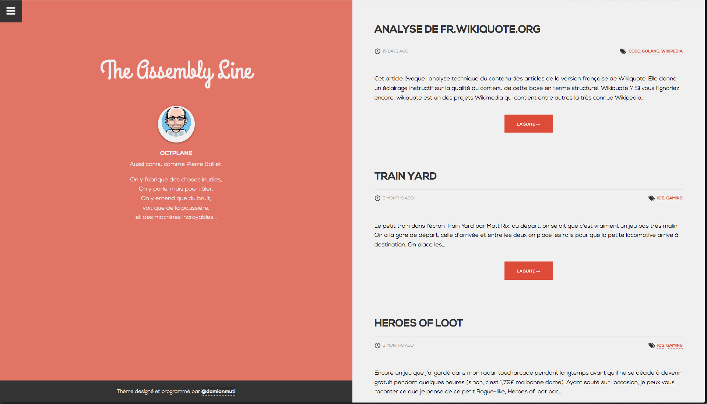

Sticko - A free Ghost theme :)
=======

## About this theme

This is a fork of [damianmuti original sticko ghost theme](https://github.com/damianmuti/sticko).

### Features
* Full responsive.
* Lightweight yet beautiful.
* Google+ Comments on Posts.
* Off-canvas navigation.
* Author info outside loop across the whole theme.
* Responsive videos (thanks to FitVid.js).
* Possibility to add cover images on posts (thanks to Thom Cullen).
* Loading indicator.
* Icon fonts - support for Retina Display/High pixel density screens.
* SCSS source files for further modifications.

### Installation

* Grab a copy of this repository.
* Place it inside your Ghost installation folder; specifically in `/content/themes/`.
* Restart your Ghost instance.
* Log in the admin panel, go to `Settings > General` and select **sticko** from the Theme dropdown menu. Then hit **Save**.

**Optional:** Set a cover image for your fresh installed blog. If you dont, dont worry; **sticko** comes with a preset cover image.

### Set a cover image for every post

[Ghost](http://ghost.org) does not let you specify a cover/featured image *yet*, but **sticko** allows that functionality just by specifying the proper alt property of the desired image:

``.

Thanks to [Thomas Cullen](https://github.com/Thomascullen92) for this great workaround.

### Setting navigation links

Open the file `nav.hbs` located in `/partials/` folder.

### Setting social media links

Open the file `social-media.hbs` located in `/partials/` folder.

### Editing footer

Open the file `footer.hbs` located in `/partials/` folder.

### Editing CSS/SCSS files.

**Sticko** is developed on top of [Sass](http://sass-lang.com/install) and [Compass](http://compass-style.org/install), which means that you are going to need both running on your own machine; follow both guides to set up the proper environment.

### Licence
[CreativeCommons Attribution 4.0 International](http://creativecommons.org/licenses/by/4.0/)

